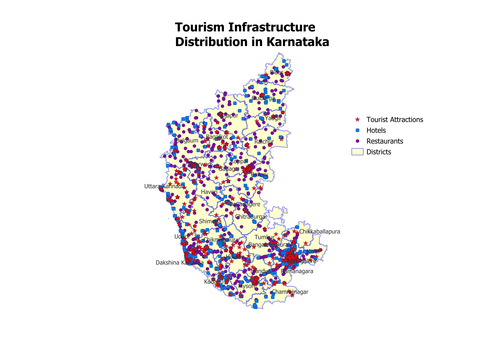
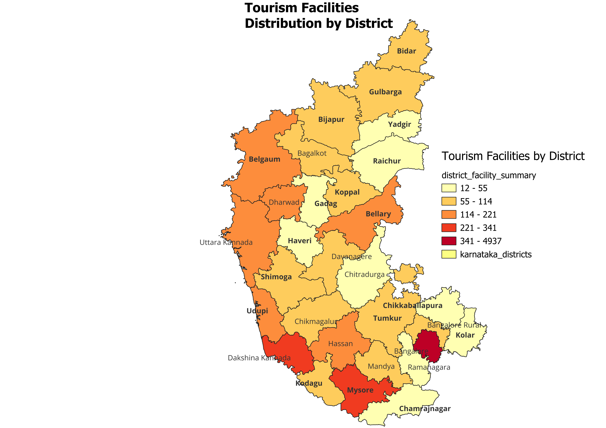

# 🗺️ Tourism Infrastructure Distribution in Karnataka

A comprehensive spatial database analysis of tourism facilities across Karnataka's districts using PostgreSQL/PostGIS and QGIS.

## 📊 Project Overview

This project analyzes the spatial distribution of tourism infrastructure (attractions, hotels, and restaurants) across Karnataka's 30 districts to identify areas with strong tourism support versus regions with development gaps.

**Course:** CS621C - Spatial Databases  
**Institution:** Maynooth University  
**Date:** November 2025 - January 2026

## 🎯 Research Questions

1. Which districts have the best tourism infrastructure?
2. How accessible are tourist attractions from hotels and restaurants?
3. What types of tourism facilities exist in Karnataka?
4. Which areas need infrastructure development?

## 📈 Dataset

- **Source:** OpenStreetMap (tourism data), DataMeet (district boundaries)
- **Coverage:** 30 Karnataka districts
- **Records Analyzed:**
  - 691 tourist attractions
  - 1,499 hotels
  - 5,854 restaurants

## 🛠️ Technologies Used

- **Database:** PostgreSQL 18 with PostGIS 3.6
- **Visualization:** QGIS 3.x
- **Languages:** SQL, Spatial SQL
- **Data Formats:** Shapefiles, GeoJSON

## 🔍 Key Findings

### 1. Infrastructure Concentration
- **Bangalore dominates** with 4,937 facilities (63% of Karnataka's tourism infrastructure)
- Top 5 districts account for 80%+ of all facilities
- Severe urban-rural divide: Bangalore has 14x more facilities than the 2nd ranked district

### 2. Accessibility Analysis
- **Urban attractions:** Excellent access with facilities within 200-500 meters
- **Rural heritage sites:** Poor access, often 20+ kilometers from nearest hotel
- Peninsular Gneiss (Bangalore) has 441 facilities within 2km walking distance

### 3. Development Gaps
- Rural districts like Haveri have only 12 total facilities
- Heritage corridor (Bagalkot) has attractions but lacks support infrastructure
- 86% of accommodation is standard hotels - limited diversity

### 4. Cultural Tourism
- Bangalore: 20 museums (42% of all Karnataka museums)
- Mysore: 6 museums
- Cultural tourism heavily concentrated in top 2 cities

## 📊 Visualizations

### Tourism Facilities Distribution

*Spatial distribution of attractions (red stars), hotels (blue squares), and restaurants (green circles)*

### Infrastructure Density by District

*Choropleth map showing facility concentration (darker = more facilities)*

## 🗄️ Spatial Analysis Techniques

### Core PostGIS Functions Used:
- **ST_Intersects:** Spatial joins to assign points to districts
- **ST_DWithin:** Buffer analysis for 2km proximity queries
- **ST_Distance:** Nearest neighbor distance calculations
- **Geography type:** Accurate meter-based distance measurements
- **Materialized Views:** Query performance optimization
- **GIST Indexes:** Spatial query acceleration

### SQL Analyses:
1. **District Distribution Analysis** - Facility counts per district
2. **Buffer Analysis** - Facilities within 2km of attractions
3. **Distance Analysis** - Nearest hotel/restaurant to each attraction
4. **Classification Analysis** - Tourism facility type breakdown
5. **Accommodation Analysis** - Hotel vs guest house distribution
6. **Cultural Tourism Analysis** - Museum distribution patterns

## 📁 Repository Structure
```
├── karnataka_tourism_analysis.sql    # Complete SQL queries and analyses
├── karnataka_tourism_overview_map.png    # Overview map visualization
├── karnataka_district_comparison_map.png # District comparison choropleth
└── README.md                         # This file
```

## 🚀 How to Run

### Prerequisites
- PostgreSQL 18+ with PostGIS extension
- QGIS 3.x (for visualization)

### Setup
1. Create database: `CREATE DATABASE karnataka_tourism;`
2. Enable PostGIS: `CREATE EXTENSION postgis;`
3. Import data (shapefiles and GeoJSON from OpenStreetMap)
4. Run queries from `karnataka_tourism_analysis.sql`

### Data Sources
- **District Boundaries:** [DataMeet India Districts](https://github.com/datameet/maps)
- **Tourism Data:** [OpenStreetMap Overpass API](https://overpass-turbo.eu/)

## 💡 Key Insights for Tourism Development

1. **Urgent need** for infrastructure investment in rural heritage districts
2. **Opportunity** to develop tourism corridors connecting isolated attractions
3. **Potential** for coastal tourism growth (Udupi, Uttara Kannada districts)
4. **Recommendation** to diversify accommodation types beyond standard hotels

## 📚 Skills Demonstrated

- Spatial database design and implementation
- Complex spatial SQL queries and optimization
- Geospatial data processing and cleaning
- Choropleth mapping and cartographic design
- Spatial analysis and pattern recognition
- Technical documentation and visualization

## 🎓 Academic Context

This project was completed as part of CS621C - Spatial Databases course, demonstrating practical application of spatial database concepts including:
- Spatial data types and geometries
- Spatial indexing strategies
- Query optimization techniques
- Real-world geospatial problem-solving

## 📧 Contact

**Snehan**   
LinkedIn: www.linkedin.com/in/snehan-snehan  
Email: snehandhanraj@gmail.com

## 📄 License

This project is for educational purposes. Data sources retain their original licenses (OpenStreetMap ODbL, DataMeet CC BY 2.5 India).

---

⭐ **If you found this project interesting, please give it a star!**
